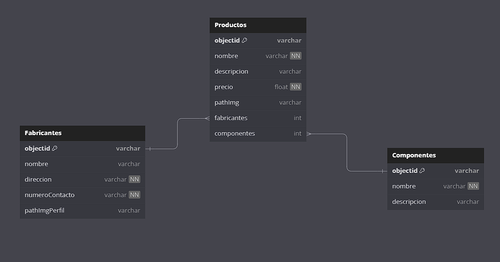

# Estrategias de Persistencia - TP 2 2024 - Documental

## Instrucciones para correr la app:
Posicionarse en el directorio donde se encuentra la aplicacion y ejecutar el siguiente comando:

**'docker compose up -d'**

Esto ejecuta la aplicación y la base de datos desde el archivo 'docker-compose.yml'.

**Importante: tener instalado Docker.**

   
## Endpoints:
| Verbo  | Recurso                    | Status code   | Descripción                                           | Detalles                                        |
| ------ | -------------------------- | ------------- | ----------------------------------------------------- | --------------------
| GET    | /productos                 | 200           | Obtener todos los productos                           |
| GET    | /productos/:id             | 200, 404      | Obtener un producto en particular                     |
| POST   | /productos                 | 201, 400      | Crear un producto                                     |
| PUT    | /productos/:id             | 200, 404      | Modificar los datos de un producto en particular      |
| DELETE | /productos/:id             | 200, 404, 500 | Borrar un producto en particular                      | No se puede borrar un producto si tiene asociaciones
| POST   | /productos/:id/fabricantes | 201, 404, 400 | Crear la asociación de producto con 1 o N fabricantes | Agrega la referencia tanto en el producto como en el fabricante. El cuerpo de la solicitud debe ser un JSON con un campo "idFabricante"
| GET    | /productos/:id/fabricantes | 200, 404      | Obtener todos los fabricantes de un producto          |
| POST   | /productos/:id/componentes | 201, 404, 400 | Crear la asociación de producto con 1 o N componentes | Agrega la referencia tanto en el producto como en el componente. El cuerpo de la solicitud debe ser un JSON con un campo "idComponente"
| GET    | /productos/:id/componentes | 200, 404      | Obtener todos los componentes de un producto          |
| GET    | /fabricantes               | 200           | Obtener todos los fabricantes                         |
| GET    | /fabricantes/:id           | 200, 404      | Obtener un fabricante en particular                   |
| POST   | /fabricantes               | 201, 400      | Crear un fabricante                                   |
| PUT    | /fabricantes/:id           | 200, 404      | Modificar los datos de un fabricante en particular    |
| DELETE | /fabricantes/:id           | 200, 404, 500 | Borrar un fabricante en particular                    | No se puede borrar un fabricante si tiene asociaciones
| GET    | /fabricantes/:id/productos | 200, 404      | Obtener todos los productos de un fabricante          |
| GET    | /componentes               | 200           | Obtener todos los componentes                         |
| GET    | /componentes/:id           | 200, 404      | Obtener un componente en particular                   |
| POST   | /componentes               | 201, 400      | Crear un componente                                   |
| PUT    | /componentes/:id           | 200, 404      | Modificar los datos de un componente en particular    |
| DELETE | /componentes/:id           | 200, 404, 500 | Borrar un componente en particular                    | No se puede borrar un componente si tiene asociaciones
| GET    | /componentes/:id/productos | 200, 404      | Obtener todos los productos de un componente          |

## Endpoints adicionales:
Agregamos dos endpoints adicionales, para adicionar la posibilidad de desasociar componentes/fabricantes de los productos.

| Verbo  | Recurso                          | Status code      | Descripción                                             | Detalles                             |
| ------ | -------------------------------- | ---------------- | ------------------------------------------------------- | -------------------------------------
| PUT    | /productos/:id/componentesDelete | 200,400,404,500  | Elimina la asociacion de un componente con el producto. | el cuerpo de la solicitud debe ser un JSON con un campo "idComponente"
| PUT    | /productos/:id/fabricantesDelete | 200,400,404,500  | Elimina la asociacion de un fabricante con el producto. | el cuerpo de la solicitud debe ser un JSON con un campo "idFabricante"

# Aclaraciones:
   * Las variables de entorno se declaran en docker-compose.yml
   * Un Producto puede tener muchos fabricantes, y un Fabricante puede fabricar muchos productos.
   * Un Producto puede tener muchos componentes, y un Componente puede formar parte de varios productos.
     

(En la imagen se muestran relaciones de 1 a N por limitaciones del software con el que realizamos los diagramas)

